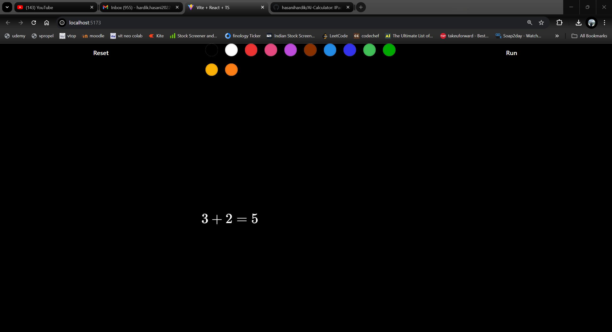

# AI-Calculator

**AI-Calculator** is a web application inspired by iPad Math Notes, allowing users to perform complex mathematical calculations and take notes interactively. The app leverages a React frontend and a Python backend for seamless functionality.

## Tech Stack

- **Frontend**: TypeScript, React, Vite
- **Backend**: Python
- **API**: Gemini API

## Features

- Interactive math calculations
- Note-taking interface
- Responsive design
- Fast and efficient with Vite
- Powered by Gemini API for advanced mathematical operations

## Installation

Clone this repo, install dependencies, run backend with `python main.py` and frontend with `npm run dev`.

# project screenshots

